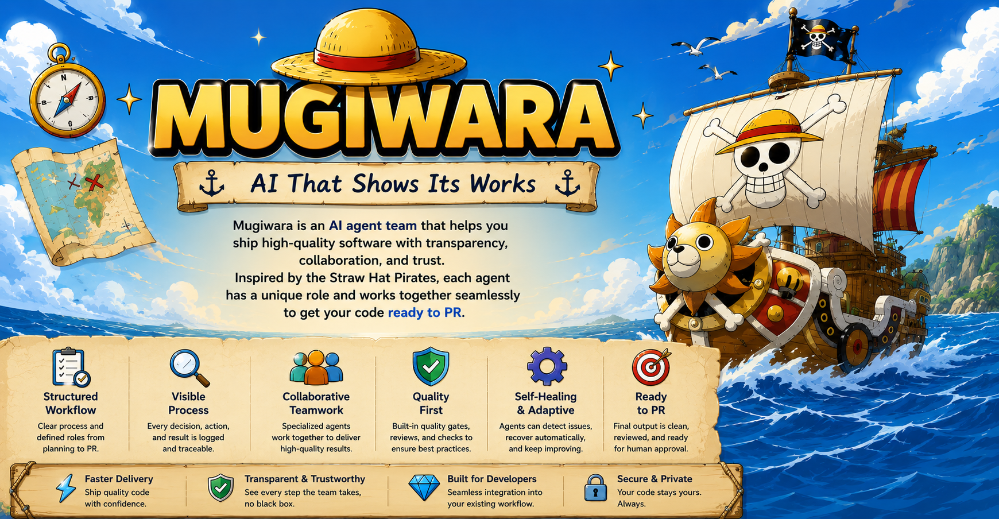

# Mugiwara

[](https://www.npmjs.com/package/@ionivetech/mugiwara) [](https://github.com/ionivetech/mugiwara/blob/main/LICENSE)

**Your AI agent already writes the code. Mugiwara makes it reviewable.**

Mugiwara wraps your agent in named roles that leave evidence at every gate.
The typo is free. The auth migration gets nine stages.



## The problem

An AI agent can write 400 lines in five minutes and say tests pass.
Nothing remains to open, read, or attach to a PR.
Review becomes a formality, and a formality launders the change through a human name.
The risk is not slowness.
The risk is a change nobody can reconstruct three weeks later when it breaks at midnight.

## What you get back

Every mission closes with one file. Your reviewer reads this, not the chat log:

```markdown
# Mission: invitation-accepted-flow
2026-09-03, farid, branch feature/MKR-412, lane full, mode guided
Verdict: GO, all gates passed. 1 finding deferred with an owner.
Changed: 11 files, +340 / -82. Sensitive: src/auth/invitation.ts, migrations/004.sql
Gates: checkpoint PASS, quality PASS, coverage PASS (new 94 percent, modified 87 percent), security PASS (0 high)
Cost: 8,781 of 12,000 tokens (73 percent). 1 heal cycle.
Left unverified: mobile deep-link fallback on old clients.
```

*Sample built from test/fixtures/report-sample.md.*

That file is the product.
The branch holds the code, the report holds the reason every gate believed it.
A reviewer opens one page, sees the verdict, the evidence, and the single loose end with its name on it.

## The process fits the work

The lane is computed from git diff, never guessed, and it only ever rises.
A one-line fix never pays for a nine-stage pipeline.
A payments migration never ships on a handshake.

| Your change | Lane | What runs |
|---|---|---|
| Typo, one file | Direct | nothing runs, the fix lands directly |
| Small bug | Lean | execute, then quality |
| Feature | Standard | plan, execute, audit, quality, review |
| Auth, payments, migrations | Full | all nine stages plus a security review |

Lanes protect both ends: small work stays fast, dangerous work cannot dodge scrutiny.
The routing decision is computed state, visible in `mugiwara status`, not a vibe the agent reports about itself.

## Install

One crew, ten pages, 12 platforms — 9 via install, 3 via marketplace manifest. Pick your harness, follow its page, end at the same roster question as proof.

| Harness | How the crew loads | Install page |
|---|---|---|
| Claude Code | native plugin plus session hook | [claude](docs/install/claude.md) |
| opencode | plugin line in `opencode.json`, restart | [opencode](docs/install/opencode.md) |
| CLI copy | installer copies rules into Windsurf, Cline, or Kilo dirs | [cli](docs/install/cli.md) |
| Codex | full bodies as rules under `.codex/mugiwara/` | [codex](docs/install/codex.md) |
| Gemini CLI | full bodies as rules under `.gemini/mugiwara/` | [gemini](docs/install/gemini.md) |
| Copilot | full bodies as rules under `.github/` | [copilot](docs/install/copilot.md) |
| Antigravity | stub pointers under `.agents/`, bodies in `.mugiwara/refs/` | [antigravity](docs/install/antigravity.md) |
| Pi | host marketplace manifest plus content pointers | [pi](docs/install/pi.md) |
| Cursor | host marketplace manifest plus content pointers | [cursor](docs/install/cursor.md) |
| Kimi Code | host marketplace manifest plus content pointers | [kimi](docs/install/kimi.md) |

Every target needs Node.js 20.11 or newer for the CLI state commands.
Without the CLI the crew still runs the pipeline, but resume, budget tracking, and the closure gate stay off, and the crew says so at Flow 0.

## First run in 60 seconds

```bash
npx @ionivetech/mugiwara@latest install --target claude --yes
mugiwara --version
```

```text
-> Claude Code (project)
   written 111, skipped 0, backed up 0
   [...]
OK mugiwara 0.9.2 installed (manifest: .mugiwara/manifest.json)
mugiwara 0.9.2
```

*Output trimmed to the anchor lines; the full run adds a config note and a hooks note.*

Then ask for something real:

```
> move auth to short-lived tokens
> add pagination to the users endpoint
> fix the typo in the header comment
```

You choose none of the routing.
The first request lands in triage, the lane is computed from the diff, and the crew announces the plan before it touches code.
Sixty seconds in, your skepticism has something concrete to bite: a manifest on disk, a version string, a plan with named owners.

## What Mugiwara does

A crew of named roles, not one voice doing everything.
Eleven specialists plus three internal helpers, 11 agents (+3 internal): Luffy triages and closes, Usopp interrogates vague asks, Nami plans, Zoro builds, Chopper audits, Sanji and Franky gate, Robin and Jinbe review, Brook heals, Skeptic re-verifies high-stakes work, Memory Keeper carries lessons, Resume rebuilds dead sessions, Eval Runner scores behavior.
Proof: [agents](docs/concepts/agents.md) names the exact moment to call each one, and Luffy never implements code.

Evidence gates, never vibes.
A stage passes only when its check ran and the ledger says so.
Chopper files findings without fixing them.
Franky returns binary PASS or FAIL.
Proof: the closing report carries checkpoint PASS, quality PASS, coverage with new-code and modified-code percentages, security with a high-finding count.

Lane sizing from the diff, shown above.
The table is the feature: computed routing with no appeal process.
Proof: `mugiwara status` prints the lane with its reason, such as `lane full (floor; computed lean)`, beside blockers and token budget.

Modes for how closely you watch.
Guided asks before each flow stage, semi runs from an approved plan, auto runs triage to closure and pauses only on a genuine blocker.
Proof: the report header records the mode, and a mid-mission flip applies from the next stage, never mid-stage. Detail: [modes](docs/concepts/modes.md).

Team split without merge pain.
One shared plan, per-person state files, conflicts flagged before merge, solo state migrating with `mugiwara migrate --to-team`.
Proof: `mugiwara status --all` reports every actor's wave, tasks, and blockers on one screen.

Resume from the exact stage.
Resume rebuilds from `.mugiwara/missions/<mission>/` on disk and continues at the recorded point, with savepoints marking known-good spots.
Proof: `mugiwara continue <mission>` prints the resume point instead of restarting, and exits nonzero when you must pick from listed options.

Provenance and signed reports.
`mugiwara handoff` writes the report the next engineer acts on (`--path` adds the provenance note), `mugiwara sign` attests it with ed25519.
Proof: `mugiwara sign <mission> --verify` checks the attestation. Detail: [provenance](docs/concepts/provenance.md).

An outcome loop, stated honestly.
Eval Runner scores skill behavior in the harness, and the Memory Keeper carries repo-local lessons from triage to closure.
What is missing is said aloud: outcome comparison against other approaches is not measured yet, and the table below keeps that row empty until a study exists.

One crew on every harness.
The same 20 skills and 14 agents ship to all twelve platforms; only the loading path changes per tier.
Proof: 322 of 322 reference pointers resolve across 9 targets, and 216 retrieval probes rank 1 at 95.9 percent, both enforced in CI. Detail: [harness matrix](docs/reference/harness-matrix.md).

A cost governor with teeth.
Every mission carries a budget by lane, warns then stops at the limit, and reports spend beside avoided work in human and JSON form.
Proof: the sample report above shows `8,781 of 12,000 tokens (73 percent)` beside the verdict, and `mugiwara cost --ledger` shows the trail. Detail: [cost](docs/concepts/cost.md).

Full index: [Every feature](docs/concepts/features.md).

## When not to use Mugiwara

- Throwaway prototype deleted tonight: the trail outlives the code, so skip the crew.
- Nobody watching chat for hours: the crew runs inline, where you can interrupt it, and unattended marathons fit a subagent harness better.
- No reviewer, no PR, no future reader: with no audience, the trail is overhead, and overhead without a reader is waste.
- Your team already trusts raw agent chat for sensitive paths: Mugiwara slows those paths on purpose, and that trade is the whole point.

Mugiwara is for teams who review. If nobody reads the report, install nothing.

## What is measured, and what is not

| Claim | Status |
|---|---|
| Retrieval routing rank-1 | **95.9%**, 216 probes (170 positive, 82 negative), in CI |
| Reference pointers resolve | **322/322**, 9 targets, in CI |
| Skill index cover | 20 skills indexed, in CI |
| Lane bases / budgets | 8,000 / 12,000 lean, 13,000 / 25,000 standard, 22,000 / 50,000 full |
| Outcome vs other approaches | not measured |

Numbers here come from `.metrics/latest.json`, refreshed by `bun run gate`. Nothing in this table is an estimate, and the last row stays empty until a comparison study exists.

## Docs

Start: [Getting started](docs/getting-started.md).
How work runs: [Workflow](docs/concepts/workflow.md), [Lanes](docs/concepts/lanes.md), [Modes](docs/concepts/modes.md), [Cost](docs/concepts/cost.md).
Who does what: [Agents](docs/concepts/agents.md).
Setup: [Install](docs/install/index.md).
Team runs: [Solo](docs/runbooks/solo-mission.md), [Team](docs/runbooks/team-mission.md).
Proof: [Harness matrix](docs/reference/harness-matrix.md), [Compliance matrix](docs/reference/compliance-matrix.md).
Stuck: [Troubleshooting](docs/runbooks/troubleshooting.md).
Issues: [tracker](https://github.com/ionivetech/mugiwara/issues).

MIT. See LICENSE.

## Start here

Run the 60-second install above, then open [Getting started](docs/getting-started.md) and hand the crew one real task.
