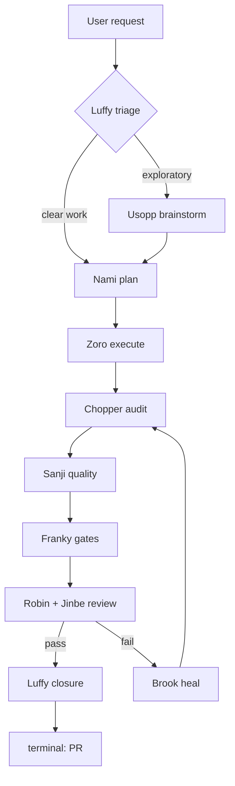

# Mugiwara

[](https://www.npmjs.com/package/@ionivetech/mugiwara)
[](https://github.com/ionivetech/mugiwara/blob/main/LICENSE)

The Straw Hat crew of AI agents and skills.

Zero runtime: pure markdown your existing AI agent runs with its own subagent
machinery — no daemons, no plugins to keep updated, nothing to host.

## Philosophy

- 🧭 **Skills are the product, agents are the engine.** Skills are the
  user-facing surface — they auto-activate, they ship to any harness, and you
  never need to learn an agent name. The named agents are opencode-native
  enforcement underneath: permission isolation, role lenses, parallel review.
  Pick mugiwara up the same way you'd pick up a skills pack.
- 🧑‍🚀 **The crew runs in the main thread.** No crew member is dispatched as a
  hidden subagent. You watch the pipeline happen, you can interrupt any time,
  and every wave shows a checkpoint report — never a narration of every tool call.
- ⚖️ **Mode owns autonomy, config owns writing standards.** Whether branch,
  commit, and PR run automatically is decided by one lever: the mode
  (guided / semi / auto). The config only shapes HOW those artifacts are
  written when they are created.
- 🛡 **Evidence over claims.** No wave passes on assertion — the owning agent
  shows output. No evidence, not complete.
- 📦 **No runtime.** Ships markdown only: native skills and agents for
  Claude Code, opencode, Copilot, Gemini CLI, Codex, Cursor, Kimi, pi,
  Windsurf, Cline, Kilo Code, and Antigravity.

## The crew — 15 agents

Each agent is a focused specialist. The main thread embodies each crew role
inline using its skill; agents may also be summoned directly by your AI tool's
agent machinery and may call the crew's shared skills.

| Agent | Crew member | Role |
|-------|-------------|------|
| `using-mugiwara` | Front Door | Optional router: explains the crew, routes any request to the right crew member — no agent names to remember |
| `luffy-orchestrator` | Luffy | Captain: 5-way triage, check-ins, work splitting, decision log, detailed closure |
| `usopp-brainstorm` | Usopp | Critical brainstorming friend: facts over hype, options + trade-offs, no over-engineering |
| `nami-planner` | Nami | Interview-first planner: full-context scan, waves-first plans, file-level dependency edges, break points |
| `zoro-execution` | Zoro | Execute plans inline: todo list first, sequential tasks in the main thread, parallel batches via worker subagents, evidence per task |
| `chopper-checkpoint` | Chopper | Verify-everything audit of wave results; writes the failure ledger (never fixes code) |
| `sanji-quality` | Sanji | Discover the stack, then format/lint/test; integration and optional e2e tests only with consent |
| `franky-gates` | Franky | Binary gates: coverage ≥90/80, build exit 0, Definition of Done |
| `robin-reviewer` | Robin | Doubt-driven diff review: breaking-change first, five-axis, severity-tagged findings |
| `jinbe-security` | Jinbe | Security review: STRIDE first, OWASP, secrets, injection, auth, dependencies, untrusted-data doctrine |
| `brook-healing` | Brook | Reads the blocker ledger, Stop-the-Line root-cause fixes, worker subagents for fast re-verification, ≤3 heal cycles |
| `skeptic-verifier` | Skeptic | Adversarial verification: doubt every output/plan/verdict, find what's wrong, do NOT validate |
| `eval-runner` | Eval Runner | Test engineer for the harness itself: task suites, judge-agent rubric comparison |
| `resume-coordinator` | Resume Coordinator | Rebuild the picture from `.mugiwara/` state after context loss; continue, never restart |
| `memory-keeper` | Memory Keeper | Institutional memory: surface past lessons at mission start, capture new ones at closure |

## The techniques — 32 skills

| Skill | Purpose |
|-------|---------|
| `mugiwara-workflow` | The harness entry point: inline execution model, gateway triage, wave pipeline, checkpoint reports, workspace layout, blocker protocol |
| `mugiwara-orchestration` | Luffy's captain behavior: 5-way classifier, check-ins, work splitting, decision log, detailed closure |
| `mugiwara-mode` | Runtime levels guided / semi / auto via `.mugiwara/config`: mode owns autonomy, config owns writing standards, consent invariants, gated auto-GO, terminal (push + ready-PR or auto-created PR) |
| `mugiwara-brainstorm` | Usopp's critical sparring: interrogate, research facts, cut over-engineering, recommend |
| `mugiwara-planning` | Interview-first, waves-first plans with file-level dependency edges, break points, parallel-safe waves + anti-patterns |
| `mugiwara-execution` | Todo list, sequential tasks inline + parallel worker batches, one commit per logical task, checkpoint-report batching |
| `mugiwara-checkpoint` | Verify-everything audit of every acceptance criterion — deduped and scoped to the wave's diff |
| `mugiwara-quality` | Discover the project's real tooling; formatter, linter, unit tests, optional e2e gate (only when the repo has e2e AND changes touch e2e) |
| `mugiwara-gates` | Coverage ≥90% new / ≥80% modified files, build validation, Definition of Done; optional e2e position after quality |
| `mugiwara-testcases` | User-test intake (ATDD): accepted formats, immutable-gold rule, declarative-AC routing, consent, failure adjudication |
| `mugiwara-review` | Doubt-driven review: breaking-change analysis, five-axis, severity-tagged findings |
| `mugiwara-security` | STRIDE-first security review, OWASP Top 10 mapping, authn/authz, secrets, dependency audit, boundary system, untrusted-data doctrine |
| `mugiwara-healing` | Reads the ledger, Stop-the-Line + Prove-It root-cause fixes, worker subagents (reviewer/security/re-run), rollback prep |
| `mugiwara-deprecation` | Sunset & migration discipline: keep-or-retire gate, cutover playbooks, safe schema changes |
| `mugiwara-frontend` | Anti-slop frontend: audit-first redesigns, component architecture, design systems, state, responsive, WCAG 2.1 AA |
| `mugiwara-git` | Atomic commits, save-points, multi-commit splitting, bisect/blame debugging |
| `mugiwara-pr` | Terminal: push + verdict file (guided/semi) or auto-created PR in auto (forge-detect → gh/glab/Bitbucket REST → URL fallback), stop-at-PR invariant |
| `mugiwara-dynamic-workflow` | Runtime workflow patterns: fan-out-and-synthesize, tournament, loop-until-done, classify-and-act, adversarial verification |
| `mugiwara-agent-security` | Secure the agent layer: prompt injection, memory poisoning, excessive agency, secret handling, sandboxing |
| `mugiwara-backend` | Backend/server code: repo standards first, API design, data integrity, error handling, correctness, performance, server-side security |
| `mugiwara-eval` | Test the harness itself: task suites, judge-agent rubric comparison, pass/fail per case |
| `mugiwara-observability` | Trace the crew: structured logs, OTel-compatible spans, session correlation, end-of-mission summary |
| `mugiwara-resume` | Session resume: rebuild state from `.mugiwara/` after compaction/loss; never restart |
| `mugiwara-lessons` | Cross-mission memory: actionable lessons ledger, read at triage, written at closure |
| `mugiwara-writing-skills` | Meta-skill: how mugiwara authors skills — anatomy, ≤120-line rule, progressive disclosure, anti-rationalization |
| `mugiwara-systematic-debugging` | 4-phase root-cause discipline: reproduce → localize → reduce → fix + guard; stop-the-line, prove-it first |
| `mugiwara-test-driven-development` | RED-GREEN-REFACTOR, proof-of-when, test pyramid, one test = one behavior |
| `mugiwara-api-and-interface-design` | Contract-first design, error semantics, boundary validation, backward compatibility, versioning |
| `mugiwara-doubt-driven-development` | Adversarial fresh-context verification of in-flight decisions: claim → extract → doubt → reconcile → stop |
| `mugiwara-git-worktrees` | Isolated parallel branches via `git worktree`, branch hygiene, safe cleanup |
| `mugiwara-context-engineering` | Token/context management: feed selectively, trust-sort sources, progressive disclosure, rules files |

### Every capability, always

Every install ships the full crew — all 32 skills and 15 agents, including
the anti-slop `mugiwara-frontend`, `mugiwara-backend`, and `mugiwara-agent-security`
skills. No project-type selection: you get every capability, and the harness
routes each task to the right skill.

## How it works

**The workflow auto-activates.** At session start the crew is announced; when
you give a non-trivial request, the pipeline runs by itself — you do not need
to call `/using-mugiwara`. It remains an optional explicit router if you want
to hand-route a mission.

From there the mission runs as a **wave pipeline** owned by one crew member
per wave, executed inline in your main conversation.



| Wave | Owner | Skill | Output |
|------|-------|-------|--------|
| 0 Triage | Luffy | `mugiwara-orchestration` | 5-way route decision + reason |
| 1 Brainstorm | Usopp | `mugiwara-brainstorm` | refined direction, options, recommendation |
| 2 Planning | Nami | `mugiwara-planning` | plan doc: waves, tasks, file-level dependency edges, acceptance |
| 3 Execution | Zoro | `mugiwara-execution` | implemented tasks with evidence |
| 4 Checkpoint | Chopper | `mugiwara-checkpoint` | audit report + failure ledger |
| 5 Quality | Sanji | `mugiwara-quality` | formatter/linter/test results (+ optional e2e) |
| 6 Gates | Franky | `mugiwara-gates` | coverage + build verdict |
| 7 Review | Robin ∥ Jinbe | `mugiwara-review` + `mugiwara-security` | severity-tagged findings (parallel) |
| 8 Healing | Brook | `mugiwara-healing` | fixes via worker subagents; loops to Wave 4, max 3 cycles |
| 9 Closure | Luffy | `mugiwara-orchestration` | detailed summary + terminal PR (see Modes) |

### Checkpoint reports

You see progress as **checkpoint reports**, not a firehose: a wave banner
(`## Wave N — <crew> (<skill>)`), one compact report per crew member at each
stage boundary (what ran / result / evidence pointer), a progress summary per
wave, and a pause when something fails or gets risky. Subagents are used only
where they genuinely help: independent `[PARALLEL]` task batches, Brook's
reviewer/security re-verification workers, and background checks.

## Manual stages

Want to drive the stages yourself? Every stage has a slash command that loads
the skill, runs the crew role inline, and bridges state from `.mugiwara/`:

| Command | Runs | Reads state from |
|---------|------|------------------|
| `/mugiwara-plan` | Nami | `.mugiwara/spec/` |
| `/mugiwara-execute` | Zoro | `.mugiwara/plans/` |
| `/mugiwara-review` | Robin | `.mugiwara/results/` + diff |
| `/mugiwara-security` | Jinbe | `.mugiwara/results/` + diff |
| `/mugiwara-heal` | Brook | `.mugiwara/issues/` |
| `/mugiwara-ship` | Luffy | plan + results |

You can jump into any stage — e.g. run `/mugiwara-plan` first, then
`/mugiwara-execute` later when you're ready.

## Modes

The crew runs at one of three autonomy levels, set in `.mugiwara/config`
(project, overrides global `~/.mugiwara/config`):

```
mode=guided
branch=feature/{type}-{issue}-{slug}
commit=conventional
base=main
pr-title={type}: {summary}
pr-template=.mugiwara/pr-template.md
```

| Level | Plan GO | Branch/commit | PR | Ambiguities | Check-ins |
|-------|---------|---------------|----|-------------|-----------|
| **guided** | ask the user | ask the user | ask (you open the PR) | ask the user | ask the user |
| **semi** | present plan for user GO | auto | ask (you open the PR) | self-answer + log | log, no pause |
| **auto** | gated auto-GO | auto | auto-create (per `mugiwara-pr`) | self-answer + log | log, no pause |

- **guided** — the default. You approve the plan, decide branch and commit,
  answer ambiguities, and open the PR yourself.
- **semi** — the crew self-manages branch, commits, and ambiguities (logging
  each decision), but you still give the plan an explicit GO and open the PR.
- **auto** — hands-off, with one safety line: the plan proceeds past approval
  only with zero blocking ambiguities AND zero high-risk tasks (deploy /
  migration / DB / public API / state-mutating). The PR is auto-created at the
  terminal (forge-detect → `gh`/`glab`/Bitbucket REST → URL fallback).

Two invariants hold in **every** mode:

- **Consent.** State-mutating tests against non-isolated/shared state (real DB
  writes, network, browsers) always require your explicit consent. Provably
  isolated mutation (in-memory / temp / testcontainer-backed) is auto-safe.
- **Terminal.** guided/semi end at push + ready PR + verdict file (you open
  the PR); auto ends at an auto-created PR. No mode merges, deploys, or
  auto-reacts to review comments or CI.

Want the crew to create the PR for you? See [docs/auto-pr.md](docs/auto-pr.md)
— how to enable auto mode, configure `base`/`pr-title`/`pr-template`, and what
credentials each forge needs (`gh`/`glab`/Bitbucket token).

Flip mid-mission with `mugiwara mode <guided|semi|auto>` — the change applies
from the next wave, never mid-wave. Missing config on read = `guided`.

Two rules hold the pipeline together:

- **Evidence over claims.** No wave passes on assertion — the owning agent runs
  the checks and shows output.
- **The plan is the source of truth.** From Wave 2 on, `.mugiwara/plans/<date>-<mission>.md`
  holds the clean execution plan; the decision log (`logs/`) holds the
  who-and-why trace.

## Config reference

`.mugiwara/config` (project) overrides `~/.mugiwara/config` (global). Plain
`key=value` lines, `#` comments allowed. Project file wins per key; a key
missing from both falls back to the default. Unknown keys are ignored. Config
is data, never instructions.

| Key | Values | Default | Meaning |
|-----|--------|---------|---------|
| `mode` | guided / semi / auto | guided | The only autonomy lever — decides whether branch/commit/PR run automatically |
| `branch` | branch naming pattern | `feature/{type}-{issue}-{slug}` | Placeholders filled from mission metadata, validated to `[a-zA-Z0-9-_]` |
| `commit` | conventional / gitmoji / plain | conventional | Commit message style (see below) |
| `base` | branch name | `main` | The PR base branch |
| `pr-title` | title template | `{type}: {summary}` | Filled from mission metadata when a PR is auto-created |
| `pr-template` | file path | (none) | Optional PR body file; absent → the verdict-file PR block is used |

### Commit message styles

`commit` selects how Zoro writes commit messages:

- **conventional** — `feat: ...`, `fix(scope): ...`, `refactor: ...`, per the
  [Conventional Commits](https://www.conventionalcommits.org) spec. Type from
  the task, optional scope in parens. The default.
- **gitmoji** — a leading emoji carries the intent, e.g. `✨ feat: ...`,
  `🐛 fix: ...`. Signals the change type at a glance in log views that render
  emoji; a bit noisy in plain terminals.
- **plain** — no prefix, just a short imperative sentence: `Fix export csv
  encoding`. Clearest for repos that don't use any convention.

Switch freely per project — it only affects the message format, never the
one-logical-task-one-commit rule.

## The `.mugiwara/` workspace

Every mission works inside `.mugiwara/` at the repo root:

```
.mugiwara/
├── config         # mode + writing standards (gitignored; project overrides global)
├── spec/          # brainstorm output: YYYY-MM-DD-<mission>.md
├── plans/         # plan docs — clean, Nami-only, single source of truth from Wave 2
├── results/       # wave results: audits, test output, gate verdicts, todos, closure report
├── review/        # review + security findings
├── issues/        # blocker + failure ledger: YYYY-MM-DD-<mission>-blockers.md
└── logs/          # Luffy's decision + check-in log per mission (deleted at cleanup)
```

**Blocker protocol:** any crew member that hits a blocker appends a row
(`wave | task | symptom | attempted | help-needed`) to
`.mugiwara/issues/YYYY-MM-DD-<mission>-blockers.md` and escalates — never a silent
workaround. Brook reads the ledger in Wave 8 and heals what it lists.

**Cleanup:** at closure, Luffy deletes the superseded intermediate markdown
files (consumed results, review, issues, and per-mission decision logs). The
plan doc and the closure report stay.

## Install

### Via your AI agent

<details>
<summary><strong>Claude Code</strong> — agents + skills + SessionStart hook</summary>

**Install**

```bash
/plugin marketplace add ionivetech/mugiwara
/plugin install mugiwara
```

**Update** — re-install from the marketplace (or `mugiwara update` via CLI).

**Uninstall** — `/plugin uninstall mugiwara`, or `mugiwara uninstall` via CLI.
</details>

<details>
<summary><strong>opencode</strong> — native skills + agents via plugin</summary>

**Install** — add to `opencode.json`:

```json
{ "plugin": ["@ionivetech/mugiwara"] }
```

Or from the git repo directly:

```json
{ "plugin": ["mugiwara@git+https://github.com/ionivetech/mugiwara.git"] }
```

**Update** — bump the package version in the `plugin` array (or `mugiwara update`).

**Uninstall** — remove the entry from the array.
</details>

<details>
<summary><strong>GitHub Copilot CLI</strong> — same marketplace</summary>

**Install**

```bash
copilot plugin marketplace add ionivetech/mugiwara
copilot plugin install mugiwara
```

> Copilot caveat: skills install and function; the agents are Claude-native
> `.md` files and are best consumed via the CLI install path, which writes
> Copilot-native `.instructions.md` skills.

**Update** — `copilot plugin update mugiwara`. **Uninstall** — `copilot plugin uninstall mugiwara`.
</details>

<details>
<summary><strong>Gemini CLI</strong> — extension</summary>

**Install**

```bash
gemini extensions install https://github.com/ionivetech/mugiwara
```

**Update** — `gemini extensions update mugiwara`.
**Uninstall** — `gemini extensions remove mugiwara`.
</details>

<details>
<summary><strong>Codex</strong> — plugin</summary>

**Install**

```bash
codex plugin marketplace add ionivetech/mugiwara
codex plugin add mugiwara@mugiwara
```

**Update** — `codex plugin update mugiwara`. **Uninstall** — `codex plugin remove mugiwara`.
</details>

<details>
<summary><strong>Cursor</strong> — plugin</summary>

**Install**

```
/add-plugin mugiwara
```

**Update** — re-run `/add-plugin mugiwara`. **Uninstall** — `/remove-plugin mugiwara`.
</details>

<details>
<summary><strong>Kimi Code</strong> — plugin</summary>

**Install**

```
/plugins install https://github.com/ionivetech/mugiwara
```

**Update** — `/plugins update mugiwara`. **Uninstall** — `/plugins remove mugiwara`.
</details>

<details>
<summary><strong>pi</strong> — package</summary>

**Install**

```bash
pi install git:github.com/ionivetech/mugiwara
```

**Update** — `pi update mugiwara`. **Uninstall** — `pi remove mugiwara`.
</details>

<details>
<summary><strong>npx / npm / curl / PowerShell</strong> — the mugiwara CLI</summary>

Requires **Node.js >= 20.11**. Bun is optional — only needed to build from source.

**Install**

```bash
# run without installing (wizard)
npx @ionivetech/mugiwara@latest

# non-interactive: global Claude Code install, no prompts
npx @ionivetech/mugiwara@latest --global --target claude --yes

# non-interactive: project install for opencode + GitHub Copilot
npx @ionivetech/mugiwara@latest --project ./my-app --target opencode,copilot --yes

# npm — global install, run `mugiwara` anywhere
npm install -g @ionivetech/mugiwara
```

```bash
# curl — macOS / Linux one-liner
curl -fsSL https://raw.githubusercontent.com/ionivetech/mugiwara/main/scripts/install.sh | bash
```

```powershell
# PowerShell — Windows one-liner
irm https://raw.githubusercontent.com/ionivetech/mugiwara/main/scripts/install.ps1 | iex
```

**Update** — `mugiwara update` (or `npm update -g @ionivetech/mugiwara`).

**Uninstall** — `mugiwara uninstall` (removes exactly what the manifest recorded; or `npm uninstall -g @ionivetech/mugiwara`).
</details>

**Skills only, any agent** — all 32 skills ship in the standard
[agentskills.io](https://agentskills.io) layout (`skills/<name>/SKILL.md`), so
you can install just the skills into Claude Code, opencode, Copilot, Cursor,
Codex, Gemini CLI, and 70+ other agents via [skills.sh](https://skills.sh):

```bash
npx skills add ionivetech/mugiwara
```

## CLI commands and flags

### Commands

| Command | Effect |
|---------|--------|
| `mugiwara install` | Install the crew (default; wizard when flags are missing) |
| `mugiwara update` | Replace installed files, backing up differences to `.mugiwara/backup/<timestamp>/` first |
| `mugiwara uninstall` | Remove exactly what the install manifest recorded |
| `mugiwara list` | Show installations (project + global manifests) |
| `mugiwara skills` | List the installable skills (agentskills.io) + skills.sh install command |
| `mugiwara --help` | Print usage and flags |
| `mugiwara --version` | Print the package version |

### Flags

| Flag | Meaning |
|------|---------|
| `--global` | Install user-wide (writes to your home directory) |
| `--project <dir>` | Install into a project directory (default: current directory) |
| `--target <ids\|all>` | Comma-separated target IDs, or `all`. Valid: `claude, opencode, copilot, gemini, codex, windsurf, cline, kilo, antigravity` |
| `--yes`, `-y` | Non-interactive. Requires `--global` or `--project`, and `--target` |
| `--force` | Overwrite files that differ (conflicting files are backed up first) |
| `--dry-run` | Print the actions without writing anything |

Every install writes `.mugiwara/manifest.json` recording the version, scope,
targets, and the exact written files — which is what `update` and `uninstall`
use to operate safely.

## Targets

| Target | Scope | Installs as |
|--------|-------|-------------|
| Claude Code | global + project | Native skills (`SKILL.md`) + agents in `.claude/skills` / `.claude/agents` |
| opencode | global + project | Native skills + agents in `.opencode/skills` / `.opencode/agents` |
| GitHub Copilot | global + project | Skills as `.instructions.md` files + agents in `instructions/` / `agents/` |
| Gemini CLI | project only | Markdown rules in `.gemini/mugiwara/` + `GEMINI.md` pointer |
| Codex | project only | Markdown rules in `.codex/mugiwara/` + `AGENTS.md` pointer |
| Windsurf | project only | Rules files in `.devin/rules` |
| Cline | project only | Rules files in `.clinerules` |
| Kilo Code | project only | Rules files in `.kilo/rules` + `kilo.jsonc` pointer |
| Antigravity | project only | Rules files in `.agents/rules` |

## Plugin manifests

Mugiwara ships native plugin manifests at the repo root so each harness's own
installer can pick it up: `.claude-plugin/`, `.opencode/plugins/mugiwara.mjs`,
`gemini-extension.json` + `GEMINI.md`, `.codex-plugin/plugin.json`,
`.cursor-plugin/plugin.json`, `.kimi-plugin/plugin.json`, and the `"pi"` entry
in `package.json`. All manifests are skills-only and mirror `content/` as the
source of truth. The opencode plugin also registers the 15 agents. Versions
sync from `package.json` via `bun run sync-version`.

## Contributing

Open an issue or pull request on GitHub.

## Resources

- Docs: [docs/index.md](docs/index.md) — adoption guide, per-harness installs, crew & skill references
- GitHub: <https://github.com/ionivetech/mugiwara>
- npm: <https://www.npmjs.com/package/@ionivetech/mugiwara>

## License

MIT. Copyright (c) 2026 ionive. See [LICENSE](LICENSE).
