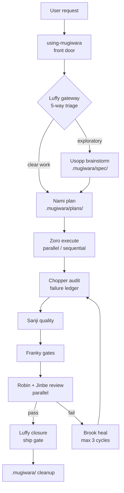

# Mugiwara

[](https://www.npmjs.com/package/@ionivetech/mugiwara)
[](https://github.com/ionivetech/mugiwara/blob/main/LICENSE)

The Straw Hat crew of AI agents and skills.

Zero runtime: pure markdown your existing AI agent runs with its own subagent
machinery — no daemons, no plugins to keep updated, nothing to host.

## Why Mugiwara

- 🧭 **A named crew.** Ten specialist agents — Luffy orchestrates, Nami plans,
  Zoro executes, Chopper audits, Brook heals — each with a narrow job.
- 📦 **No runtime.** Ships markdown only: native skills and agents for
  Claude Code, opencode, Copilot, Gemini CLI, Codex, Cursor, Kimi, pi,
  Windsurf, Cline, Kilo Code, and Antigravity.
- 🔁 **Wave pipeline.** brainstorm → plan → execute → audit → quality → gates
  → review → security → heal → closure. Failure loops back through healing
  (max 3 cycles), never ships broken.
- 🛡 **Evidence over claims.** No wave passes on assertion — the owning agent
  shows output. No evidence, not complete.
- ⚡ **One-command install.** `npx`, `npm -g`, curl, or PowerShell — interactive
  wizard or fully scriptable with flags.
- 🧪 **Everything validated.** Coverage gates, build gates, OWASP security
  review, doubt-driven diff review, Definition of Done.

### The crew — 15 agents

Each agent is a focused specialist. Agents are dispatched by your AI tool's
subagent machinery and may call the crew's shared skills.

| Agent | Crew member | Role |
|-------|-------------|------|
| `using-mugiwara` | Front Door | Start here: routes any request to the right crew member — no agent names to remember |
| `luffy-orchestrator` | Luffy | Main gateway: 5-way triage, background check-ins, work splitting, decision log, closure |
| `usopp-brainstorm` | Usopp | Critical brainstorming friend: facts over hype, options + trade-offs, no over-engineering |
| `nami-planner` | Nami | Interview-first planner: full-context scan, wave structure, anti-patterns, parallel-safe plans |
| `zoro-execution` | Zoro | Execute plans: todo list first, parallel/sequential subagent dispatch, evidence per task |
| `chopper-checkpoint` | Chopper | Verify-everything audit of wave results; writes the failure ledger (never fixes code) |
| `sanji-quality` | Sanji | Discover the stack, then format/lint/test; integration tests only with consent |
| `franky-gates` | Franky | Binary gates: coverage ≥90/80, build exit 0, Definition of Done |
| `robin-reviewer` | Robin | Doubt-driven diff review: breaking-change first, five-axis, severity-tagged findings |
| `jinbe-security` | Jinbe | Security review: OWASP, secrets, injection, auth, dependencies, untrusted-data doctrine |
| `brook-healing` | Brook | Reads the blocker ledger, Stop-the-Line root-cause fixes, ≤3 heal cycles |
| `skeptic-verifier` | Skeptic | Adversarial verification: doubt every output/plan/verdict, find what's wrong, do NOT validate |
| `eval-runner` | Eval Runner | Test engineer for the harness itself: task suites, judge-agent rubric comparison, fix the skill not the eval |
| `resume-coordinator` | Resume Coordinator | Rebuild the picture from `.mugiwara/` state after context loss; continue, never restart |
| `memory-keeper` | Memory Keeper | Institutional memory: surface past lessons at mission start, capture new ones at closure |

### The techniques — 25 skills

| Skill | Purpose |
|-------|---------|
| `mugiwara-workflow` | The harness entry point: gateway triage, wave pipeline, workspace layout, blocker protocol, cleanup |
| `mugiwara-orchestration` | Luffy's captain behavior: 5-way classifier, check-ins, work splitting, decision log, closure |
| `mugiwara-mode` | Runtime levels guided / semi / auto via `.mugiwara/config`: branch + commit style, consent invariants, gated auto-GO, push + ready-PR terminal |
| `mugiwara-brainstorm` | Usopp's critical sparring: interrogate, research facts, cut over-engineering, recommend |
| `mugiwara-planning` | Interview-first, full-context scan, wave plans with parallel/sequential markers + anti-patterns |
| `mugiwara-execution` | Todo list, parallel batches + sequential chains, 6-field subagent delegation, one task one commit |
| `mugiwara-checkpoint` | Verify-everything audit of every acceptance criterion; failure rows to the blocker ledger |
| `mugiwara-quality` | Discover the project's real tooling; formatter, linter, unit + consent-gated integration tests |
| `mugiwara-gates` | Coverage ≥90% new / ≥80% modified files, build validation, Definition of Done; user-AC verdict overrides thresholds |
| `mugiwara-testcases` | User-test intake (ATDD): accepted formats, immutable-gold rule, declarative-AC routing, consent, failure adjudication |
| `mugiwara-review` | Doubt-driven review: breaking-change analysis, five-axis, severity-tagged findings |
| `mugiwara-security` | OWASP-driven security review, untrusted-data doctrine, severity by exploitability × impact |
| `mugiwara-healing` | Reads the ledger, Stop-the-Line + Prove-It root-cause fixes, rollback prep |
| `mugiwara-deprecation` | Sunset & migration discipline: keep-or-retire gate, cutover playbooks, safe schema changes |
| `mugiwara-frontend` | Anti-slop frontend: audit-first redesigns, design-system extraction, slop list |
| `mugiwara-git` | Atomic commits, save-points, multi-commit splitting, bisect/blame debugging |
| `mugiwara-ship` | GO/NO-GO ship gate: pre-launch checklist, feature flags, rollback plan |
| `mugiwara-pr` | CI/CD loop terminal: one verdict file + one comment + one check-run on the ready PR via `gh`, stop-at-PR invariant |
| `mugiwara-dynamic-workflow` | Runtime workflow patterns: fan-out-and-synthesize, tournament, loop-until-done, classify-and-act, adversarial verification |
| `mugiwara-agent-security` | Secure the agent layer: prompt injection, memory poisoning, excessive agency, secret handling, sandboxing |
| `mugiwara-backend` | Backend/server code: repo standards first, API design, data integrity, error handling, correctness, performance, server-side security |
| `mugiwara-eval` | Test the harness itself: task suites, judge-agent rubric comparison, pass/fail per case |
| `mugiwara-observability` | Trace the crew: structured logs, OTel-compatible spans, session correlation, end-of-mission summary |
| `mugiwara-resume` | Session resume: rebuild state from `.mugiwara/` after compaction/loss; never restart |
| `mugiwara-lessons` | Cross-mission memory: actionable lessons ledger, read at triage, written at closure |

### Every capability, always

Every install ships the full crew — all 25 skills and 15 agents, including
the anti-slop `mugiwara-frontend`, `mugiwara-backend`, and `mugiwara-agent-security`
skills. No project-type selection: you get every capability, and the harness
routes each task to the right skill.

## How it works

Every mission starts with `using-mugiwara` — the easy-to-remember front door
that routes you to the right crew member (no agent names to memorize). It
feeds the **Luffy gateway**, which classifies the request (trivial / explicit /
exploratory / open-ended / ambiguous) and routes it: exploratory ideas go to
Usopp's brainstorm, clear work goes straight to Nami's planning. You can also
summon any crew member directly. From there the mission runs as a **wave
pipeline** owned by one crew member per wave.



The same pipeline as a portable table (renders anywhere markdown does):

| Wave | Owner | Skill | Output |
|------|-------|-------|--------|
| 0 Triage | Luffy | `mugiwara-orchestration` | 5-way route decision + reason |
| 1 Brainstorm | Usopp | `mugiwara-brainstorm` | refined direction, options, recommendation |
| 2 Planning | Nami | `mugiwara-planning` | plan doc: waves, tasks, acceptance criteria |
| 3 Execution | Zoro | `mugiwara-execution` | implemented tasks with evidence |
| 4 Checkpoint | Chopper | `mugiwara-checkpoint` | audit report + failure ledger |
| 5 Quality | Sanji | `mugiwara-quality` | formatter/linter/test results |
| 6 Gates | Franky | `mugiwara-gates` | coverage + build verdict |
| 7 Review | Robin ∥ Jinbe | `mugiwara-review` + `mugiwara-security` | severity-tagged findings (parallel) |
| 8 Healing | Brook | `mugiwara-healing` | fixes; loops back to Wave 4, max 3 cycles |
| 9 Closure | Luffy | `mugiwara-orchestration` | push + ready PR, verdict comment + check-run via `mugiwara-pr`, closure report in `.mugiwara/results/` + cleanup |

Three runtimes in one crew: the mission runs at a mode level (`guided` asks at every gate, `semi`/`auto` self-answer and log, all from `.mugiwara/config`); declared user test cases are taken in as ATDD gold (`mugiwara-testcases`); every mission ends at a push + ready PR with one verdict comment + check-run (`mugiwara-pr`).

Two rules hold the pipeline together:

- **Evidence over claims.** No wave passes on assertion — the owning agent runs
  the checks and shows output. A wave that cannot produce evidence is a failed
  wave. ("Subagents lie. No evidence = not complete.")
- **The plan is the source of truth.** From Wave 2 on, `.mugiwara/plans/<date>-<mission>.md` holds the clean execution plan; the decision log (`logs/`) holds the who-and-why trace. No wave is skipped without the reason recorded there.

### The `.mugiwara/` workspace

Every mission works inside `.mugiwara/` at the repo root:

```
.mugiwara/
├── spec/          # brainstorm output: YYYY-MM-DD-<mission>.md
├── plans/         # plan docs — clean, Nami-only, single source of truth from Wave 2
├── results/       # wave results: audits, test output, gate verdicts, todos, closure report
├── review/        # review + security findings
├── issues/        # blocker + failure ledger: YYYY-MM-DD-<mission>-blockers.md
└── logs/          # Luffy's decision + check-in log per mission (deleted at cleanup)
```

Every non-trivial mission starts with `using-mugiwara`, which routes through the
Luffy gateway; from Wave 2 the mission runs as a wave pipeline owned by one crew
member per wave. The main thread dispatches each crew member one at a time as a
top-level task (never nested crew-inside-crew), so every agent's work is visible
as it happens.

**Blocker protocol:** any crew member that hits a blocker appends a row
(`wave | task | symptom | attempted | help-needed`) to
`.mugiwara/issues/YYYY-MM-DD-<mission>-blockers.md` and escalates — never a silent
workaround. Brook reads the ledger in Wave 8 and heals what it lists.

**Cleanup:** at closure, Luffy deletes the superseded intermediate markdown
files (consumed results, review, issues, and per-mission decision logs). The
plan doc and the closure report stay.

The owning agent creates the folder it needs on first write. Mission artifacts
never land outside `.mugiwara/`.

## Install

### Via your AI agent

Install the crew straight from your agent's own plugin system — no CLI needed.
Pick your harness:

**Claude Code** (fully supported — agents + skills + SessionStart hook)

```bash
/plugin marketplace add ionivetech/mugiwara
/plugin install mugiwara
```

**GitHub Copilot CLI** (same marketplace)

```bash
copilot plugin marketplace add ionivetech/mugiwara
copilot plugin install mugiwara
```

**opencode** (native skills + agents via the opencode plugin)

```json
{ "plugin": ["@ionivetech/mugiwara"] }
```

Or from the git repo directly:

```json
{ "plugin": ["mugiwara@git+https://github.com/ionivetech/mugiwara.git"] }
```

**Codex**

```bash
codex plugin marketplace add ionivetech/mugiwara
codex plugin add mugiwara@mugiwara
```

**Cursor**

```
/add-plugin mugiwara
```

**Gemini CLI**

```bash
gemini extensions install https://github.com/ionivetech/mugiwara
```

**Kimi Code**

```
/plugins install https://github.com/ionivetech/mugiwara
```

**pi**

```bash
pi install git:github.com/ionivetech/mugiwara
```

Agent installs register the 25 skills; the agents (Luffy, Nami, Zoro, …) come
natively with the harnesses that support them (Claude Code, opencode). On
harnesses that install skills only (Gemini, Codex, Cursor, Kimi, pi), the
agents are available via the CLI below.

### Via script / CLI

Requires **Node.js >= 20.11**. Bun is optional — only needed to build from
source.

```bash
# npx — run without installing
npx @ionivetech/mugiwara@latest

# non-interactive: global Claude Code install, no prompts
npx @ionivetech/mugiwara@latest --global --target claude --yes

# non-interactive: project install for opencode + GitHub Copilot
npx @ionivetech/mugiwara@latest --project ./my-app --target opencode,copilot --yes

# npm — global install, run `mugiwara` anywhere
npm install -g @ionivetech/mugiwara
```

```bash
# curl — macOS / Linux one-liner
curl -fsSL https://raw.githubusercontent.com/ionivetech/mugiwara/main/scripts/install.sh | bash
```

```powershell
# PowerShell — Windows one-liner
irm https://raw.githubusercontent.com/ionivetech/mugiwara/main/scripts/install.ps1 | iex
```

The `install.sh` / `install.ps1` scripts check your Node version, then run the
same CLI (`npx -y @ionivetech/mugiwara@latest`), forwarding any flags you pass.

**Skills only, any agent** — the 25 skills also ship in the standard
[agentskills.io](https://agentskills.io) layout (`skills/<name>/SKILL.md`), so
you can install just the skills into Claude Code, opencode, Copilot, Cursor,
Codex, Gemini CLI, and 70+ other agents via [skills.sh](https://skills.sh):

```bash
npx skills add ionivetech/mugiwara
```

Skills only — agents (Luffy, Nami, Zoro, …) are harness-specific and install
via the agent-native methods above or the mugiwara CLI. `mugiwara skills`
lists the installable set.

### Requirements

| Dependency | Required for | Version |
|------------|--------------|---------|
| Node.js | running the CLI and the built artifact | >= 20.11 |
| Bun | building from source, running tests | optional |

## Quickstart

```console
$ npx @ionivetech/mugiwara@latest --global --target claude --yes
mugiwara — installing crew for: claude
  ✓ claude    15 agents, 25 skills → ~/.claude/skills + ~/.claude/agents
  ✓ manifest  wrote ~/.mugiwara/manifest.json
  ✓ done      24 files written

$ # now just ask your Claude Code session
> add dark mode to the settings page

  Wave 0  Luffy   triage → route: plan (requirements mostly clear)
  Wave 2  Nami    plan   → .mugiwara/plans/2026-08-10-dark-mode.md (3 waves)
  Wave 3  Zoro    execute→ 3 tasks, evidence shown per task
  Wave 4  Chopper audit  → FAIL: toggle does not persist (ledger written)
  Wave 8  Brook   heal   → fixed persistence + tests, looped back → PASS
  Wave 9  Luffy   closure→ report appended to plan, intermediate files cleaned
```

You never drive the sequence — you answer Nami's clarifying questions up front
and review Brook's rollback note if a fix is risky.

## Commands and flags

### Commands

| Command | Effect |
|---------|--------|
| `mugiwara install` | Install the crew (default; wizard when flags are missing) |
| `mugiwara update` | Replace installed files, backing up differences to `.mugiwara/backup/<timestamp>/` first (project root, or `~` for global) |
| `mugiwara uninstall` | Remove exactly what the install manifest recorded |
| `mugiwara list` | Show installations (project + global manifests) |
| `mugiwara skills` | List the installable skills (agentskills.io) + skills.sh install command |
| `mugiwara --help` | Print usage and flags |
| `mugiwara --version` | Print the package version |

### Flags

| Flag | Meaning |
|------|---------|
| `--global` | Install user-wide (writes to your home directory) |
| `--project <dir>` | Install into a project directory (default: current directory) |
| `--target <ids\|all>` | Comma-separated target IDs, or `all`. Valid: `claude, opencode, copilot, gemini, codex, windsurf, cline, kilo, antigravity` |
| `--yes`, `-y` | Non-interactive. Requires `--global` or `--project`, and `--target` |
| `--force` | Overwrite files that differ (conflicting files are backed up first) |
| `--dry-run` | Print the actions without writing anything |

```bash
# non-interactive install requires scope + target, or it errors out
npx @ionivetech/mugiwara@latest --project ./app --target claude --yes

# preview what an install would write, without touching the disk
npx @ionivetech/mugiwara@latest --global --target all --yes --dry-run

# global installs skip targets that only support project scope (with a note)
npx @ionivetech/mugiwara@latest --global --target all --yes
```

### Install manifest

Every install writes `.mugiwara/manifest.json` (in the project dir, or `~` for
global). The manifest records the version, scope, targets, and the exact
list of written files — which is what `update` and `uninstall` use to operate
safely.

## Targets

All nine supported targets. **Native** targets get first-class skills and
agents; the rest get markdown rule files the tool picks up from a conventions
directory. Targets marked *project only* are skipped (with a note) when you
install with `--global`.

| Target | Scope | Installs as |
|--------|-------|-------------|
| Claude Code | global + project | Native skills (`SKILL.md`) + agents in `.claude/skills` / `.claude/agents` (`~/.claude` globally) |
| opencode | global + project | Native skills + agents in `.opencode/skills` / `.opencode/agents` (`~/.config/opencode` globally) |
| GitHub Copilot | global + project | Skills as `.instructions.md` files + agents in `instructions/` / `agents/` (`.github` project, `~/.copilot` global) |
| Gemini CLI | project only | Markdown rules in `.gemini/mugiwara/` + `GEMINI.md` pointer |
| Codex | project only | Markdown rules in `.codex/mugiwara/` + `AGENTS.md` pointer |
| Windsurf | project only | Rules files in `.devin/rules` |
| Cline | project only | Rules files in `.clinerules` |
| Kilo Code | project only | Rules files in `.kilo/rules` + `kilo.jsonc` pointer |
| Antigravity | project only | Rules files in `.agents/rules` |

For rule-based targets, skills land as `mugiwara-*.md` and agents as
`agent-<name>.md`. Targets with a bootstrap file (`Gemini`, `Codex`, `Kilo`)
create it if it doesn't exist and otherwise tell you the line to add, so your
tool points at the crew.

## Plugin manifests

Beyond the Claude Code marketplace, mugiwara ships native plugin manifests at
the repo root so each harness's own installer can pick it up:

| Manifest | Harness |
|----------|---------|
| `.claude-plugin/` | Claude Code + GitHub Copilot CLI (marketplace) |
| `.opencode/plugins/mugiwara.mjs` | opencode (`plugin` array in `opencode.json`) |
| `gemini-extension.json` + `GEMINI.md` | Gemini CLI |
| `.codex-plugin/plugin.json` | Codex |
| `.cursor-plugin/plugin.json` | Cursor |
| `.kimi-plugin/plugin.json` | Kimi Code |
| `package.json` `"pi"` | pi |

All manifests are skills-only and mirror `content/` as the source of truth —
no hooks, no runtime. The opencode plugin also registers the 15 agents as
subagents. Version numbers in the manifests sync from `package.json` via
`bun run sync-version` (runs automatically on publish).

> **Copilot caveat.** Copilot CLI reads the Claude marketplace for skills, but
> the agents are **Claude-native `.md` files** — they do not auto-discover in
> Copilot. Skills install and function; agents are best consumed through the
> regular CLI install path (which writes Copilot-native `.instructions.md`
> skills and `.md` agents).

## Contributing

Open an issue or pull request on GitHub.

## Resources

- GitHub: <https://github.com/ionivetech/mugiwara>
- npm: <https://www.npmjs.com/package/@ionivetech/mugiwara>

## License

MIT. Copyright (c) 2026 ionive. See [LICENSE](LICENSE).
