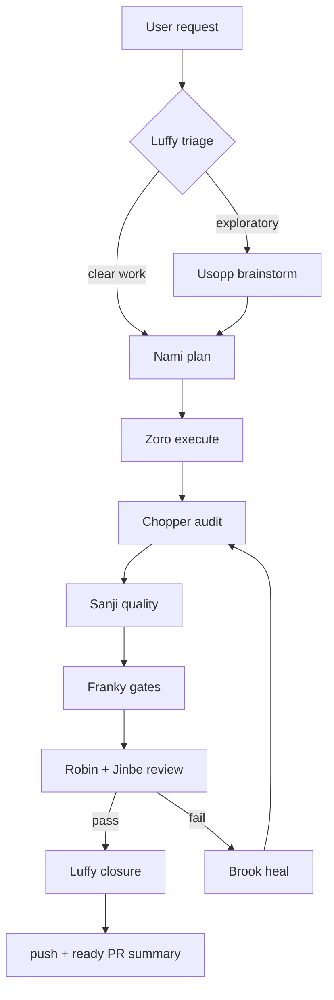

# Mugiwara

[](https://www.npmjs.com/package/@ionivetech/mugiwara)
[](https://github.com/ionivetech/mugiwara/blob/main/LICENSE)

**The Straw Hat crew of AI agents and skills.** A complete software
development workflow for your coding agent — triage, planning, execution,
verification, review, and shipping — with the discipline of a senior
engineering team.

Mugiwara is pure markdown. No daemons, no servers, no plugin to babysit. Your
existing coding agent reads the skills and runs them itself. It works across
12 coding agents — Claude Code, opencode, Gemini CLI, Codex, Cursor, Copilot,
Kimi, pi, Windsurf, Cline, Kilo Code, and Antigravity — and installs into
70+ more as plain skills.

```
   TRIAGE            PLAN             BUILD            VERIFY            REVIEW            SHIP
 ┌──────────┐     ┌──────────┐     ┌──────────┐     ┌──────────┐     ┌──────────┐     ┌──────────┐
 │ Luffy    │ ──▶ │ Nami     │ ──▶ │ Zoro     │ ──▶ │ Chopper  │ ──▶ │ Robin +  │ ──▶ │ push +   │
 │ 5-way    │     │ waves +  │     │ TDD per  │     │ Sanji +  │     │ Jinbe    │     │ ready PR │
 │ triage   │     │ tasks    │     │ task     │     │ Franky   │     │ review+  │     │ summary  │
 └──────────┘     └──────────┘     └──────────┘     └──────────┘     └──────────┘     └──────────┘
   ↰ exploratory → Usopp brainstorms            fail → Brook heals ↺ Wave 4
```

## Why mugiwara

- **It just starts.** Give a non-trivial request — "add dark mode to the
  settings page" — and the crew runs the pipeline in your main conversation,
  with a compact checkpoint report at every stage. Nothing hides behind a
  subagent click; you can interrupt any time.
- **The work is sized before it runs.** A one-file typo runs zero waves. An
  architecture change runs all nine. Luffy routes each mission to a lane, so a
  tiny fix never pays the price of a big feature — and a sensitive change never
  sneaks through the lean path.
- **Evidence over claims.** No wave passes on a spoken "it works." The owning
  agent runs the checks and shows output. Every skill also knows when it does
  *not* apply — and says so, out loud.
- **It remembers.** Mission state lives in `.mugiwara/` — plans, results, a
  failure ledger, and a lessons file. Lose context mid-mission and the crew
  rebuilds from disk instead of restarting.
- **You stay in control.** The crew pushes the branch and hands you a
  ready-to-paste PR summary. It never creates a PR, merges, or deploys on its
  own. Three autonomy levels — guided, semi, auto — decide how much it does
  without asking.

## Quick start

Install into your harness in one command, then just ask:

```bash
# Claude Code
/plugin marketplace add ionivetech/mugiwara && /plugin install mugiwara

# opencode
{ "plugin": ["@ionivetech/mugiwara"] }   # add to opencode.json

# or via CLI for any target
npx @ionivetech/mugiwara@latest --project ./my-app --target all --yes
```

```text
> add dark mode to the settings page
```

The crew announces itself at session start and routes the request. See
[docs/getting-started.md](docs/getting-started.md) for the full walkthrough.

---

## The crew — 15 agents

Each agent is a focused specialist. The main thread embodies each role inline
using its skill; you can also summon any member directly by name. "Dispatch"
means *route the mission to this role* — crew members never dispatch each other.

| Agent | Crew member | Role | Summon for |
|-------|-------------|------|------------|
| `using-mugiwara` | Front Door | Router — classifies and routes, never implements | any new mission |
| `luffy-orchestrator` | Luffy | Captain — 5-way triage, lane sizing, check-ins, closure | mission start, escalations |
| `usopp-brainstorm` | Usopp | Critical friend — interrogates ideas, researches, no rubber-stamps | vague ideas, direction, options |
| `nami-planner` | Nami | Planner — interview-first, full-context scan, scaled plans | turning an idea into a plan |
| `zoro-execution` | Zoro | Executor — todo list first, inline tasks, parallel worker batches, evidence per task | executing an approved plan |
| `chopper-checkpoint` | Chopper | Auditor — re-verifies every acceptance criterion, writes the failure ledger, never fixes | auditing a wave's results |
| `sanji-quality` | Sanji | Quality — discovers real tooling, format / lint / test | after checkpoint passes |
| `franky-gates` | Franky | Gates — coverage, build, Definition of Done, binary verdicts | after quality checks |
| `robin-reviewer` | Robin | Reviewer — doubt-driven diff review, breaking-change map first | after gates pass |
| `jinbe-security` | Jinbe | Security — STRIDE, OWASP, secrets, injection, auth, dependencies | security audit of a diff |
| `brook-healing` | Brook | Healer — reads the ledger, root-cause fixes, proves each fix, ≤3 cycles | any wave produced failures |
| `skeptic-verifier` | Skeptic | Adversarial verifier — doubts every output, never validates | high-stakes verdicts, plans, reviews |
| `eval-runner` | Eval Runner | Harness tester — task suites, rubric comparison, pass/fail | verifying mugiwara itself works |
| `resume-coordinator` | Resume Coordinator | Resumer — rebuilds from `.mugiwara/`, continues never restarts | context loss, new session mid-mission |
| `memory-keeper` | Memory Keeper | Institutional memory — surfaces past lessons, captures new ones | mission start + closure |

Say a name and the role embodies itself:

```
> Chopper, audit the last wave against the plan
> Nami, plan this out
```

Luffy still records the route and its reason, and direct calls do not skip
check-ins. See [docs/agents.md](docs/agents.md).

---

## The techniques — 32 skills

Skills are the actual product: portable markdown playbooks that tell the agent
*how* to do each phase well. Agents are the personas; skills are the
knowledge. Every skill declares **when to use it** and **when to skip it**.

### The pipeline

| Skill | Used when |
|-------|-----------|
| `mugiwara-workflow` | starting any non-trivial mission — the harness entry point |
| `mugiwara-orchestration` | triaging a new mission, coordinating waves, closing out |
| `mugiwara-brainstorm` | exploring a vague idea or architecture choice before planning |
| `mugiwara-planning` | turning an approved idea or spec into an execution plan |
| `mugiwara-execution` | executing an approved wave-structured plan |
| `mugiwara-checkpoint` | auditing a wave's results against the plan, criterion by criterion |
| `mugiwara-healing` | earlier waves produced failures — test, gate, review, or security findings |
| `mugiwara-resume` | a mission was interrupted, context lost, or a new session starts mid-mission |
| `mugiwara-mode` | reading or changing the autonomy level (guided / semi / auto) |

### Engineering practice

| Skill | Used when |
|-------|-----------|
| `mugiwara-test-driven-development` | writing code during execution — RED-GREEN-REFACTOR |
| `mugiwara-testcases` | a mission declares user-provided test cases or acceptance criteria |
| `mugiwara-systematic-debugging` | a bug, crash, or unexplained regression needs root-cause discipline |
| `mugiwara-api-and-interface-design` | designing or reviewing an API, interface, or inter-service contract |
| `mugiwara-doubt-driven-development` | an in-flight decision is cheap to verify now but costly to reverse later |
| `mugiwara-context-engineering` | working in a large codebase, long session, or near the context limit |
| `mugiwara-git` | committing, splitting commits, or debugging via git history |
| `mugiwara-git-worktrees` | running parallel branches without polluting the working tree |
| `mugiwara-deprecation` | retiring code or steering users onto a replacement |
| `mugiwara-frontend` | any frontend implementation or redesign — anti-slop, WCAG 2.1 AA |
| `mugiwara-backend` | implementing or reviewing backend/server code |
| `mugiwara-agent-security` | reviewing the agent layer itself — injection, poisoning, excessive agency |

### Verification & review

| Skill | Used when |
|-------|-----------|
| `mugiwara-quality` | running format / lint / test after checkpoint passes |
| `mugiwara-gates` | enforcing coverage, build, and Definition of Done |
| `mugiwara-review` | reviewing the diff adversarially after gates pass |
| `mugiwara-security` | running the security audit of a diff or system |
| `mugiwara-ship` | running the pre-launch gate before anything reaches users |

### Team & meta

| Skill | Used when |
|-------|-----------|
| `mugiwara-pr` | pushing the branch and preparing the PR material at closure |
| `mugiwara-lessons` | reading/writing the cross-mission lessons ledger |
| `mugiwara-observability` | tracing how the crew ran a mission |
| `mugiwara-dynamic-workflow` | a mission has many subtasks, needs comparison, or risks agent bias |
| `mugiwara-eval` | verifying a mugiwara skill or agent actually works |
| `mugiwara-writing-skills` | authoring or revising a mugiwara skill |

Every install ships the full set — no project-type selection. The harness
routes each task to the right skill, and a skill with nothing to do says so and
steps aside. See [docs/skills.md](docs/skills.md) for the anatomy and
[docs/skill-anatomy.md](docs/skill-anatomy.md) for the format spec.

---

## How mugiwara works

### Auto-activation

At session start the crew is announced. Give a non-trivial request and the
pipeline runs by itself — no command to remember. `/using-mugiwara` remains an
optional router if you want to hand-route a mission.

### Sizing: the lanes

At Wave 0, Luffy sizes the request and picks a lane. The lane decides how many
waves run:

| Lane | Picks when | Waves |
|------|-----------|-------|
| **0 · Direct** | typo, rename, one file under 20 lines | none |
| **1 · Lean** | bug in 1-2 files, under 50 lines | execute → quality |
| **2 · Standard** | feature, 3-8 files | plan → execute → checkpoint → review |
| **3 · Full** | architecture, migration, auth/payment, API | all 9 waves |
| **4 · Spike** | exploratory, needs direction | brainstorm → re-triage |

The lane escalates when the work outgrows the estimate (the diff balloons, a
sensitive path appears, failures repeat) — but never shrinks on its own.
Under-process costs more than over-process.

### The wave pipeline



| Wave | Owner | Skill | Output |
|------|-------|-------|--------|
| 0 Triage | Luffy | `mugiwara-orchestration` | route + lane + reason |
| 1 Brainstorm | Usopp | `mugiwara-brainstorm` | refined direction, options, recommendation |
| 2 Planning | Nami | `mugiwara-planning` | plan doc: waves, tasks, dependency edges, acceptance |
| 3 Execution | Zoro | `mugiwara-execution` | implemented tasks with evidence |
| 4 Checkpoint | Chopper | `mugiwara-checkpoint` | audit report + failure ledger |
| 5 Quality | Sanji | `mugiwara-quality` | formatter / linter / test results |
| 6 Gates | Franky | `mugiwara-gates` | coverage + build verdict |
| 7 Review | Robin ∥ Jinbe | `mugiwara-review` + `mugiwara-security` | severity-tagged findings |
| 8 Healing | Brook | `mugiwara-healing` | fixes; loops to Wave 4, max 3 cycles |
| 9 Closure | Luffy | `mugiwara-orchestration` | summary + push + ready PR summary |

**You see progress, not a firehose.** Each wave opens with a banner
(`## Wave N — <crew> (<skill>)`), closes with a compact checkpoint report (what
ran / result / evidence pointer), and pauses when something fails or gets
risky. Subagents appear only where they genuinely help: parallel task batches
and independent re-verification.

### What a mission looks like

Small and specific:

```
> fix the date formatting bug in src/utils/format.ts
```

Luffy routes it to **Lane 1** and the crew runs two waves — Zoro reproduces and
fixes, then Sanji formats and tests — all visible as checkpoint reports. No
nine-wave ceremony for a one-file bug.

Big and sensitive:

```
> add role-based access control to the API
```

That touches auth, so Luffy routes it to **Lane 3**. Nami plans the migration
waves, Zoro executes test-first, Chopper re-verifies every criterion, Sanji and
Franky gate it, Robin and Jinbe review, Brook heals anything that fails, and
Luffy closes with a ready PR summary. Every wave reports inline.

That is the point of mugiwara: **the process scales to the work, and you can
see all of it.**

### The workspace

Every mission works inside `.mugiwara/` at the repo root:

```
.mugiwara/
├── config         # mode + writing standards (gitignored)
├── spec/          # brainstorm output
├── plans/         # plan docs — clean, Nami-only, source of truth from Wave 2
├── results/       # wave results: audits, test output, gate verdicts
├── review/        # review + security findings
├── issues/        # blocker + failure ledger
├── refs/          # full skill/agent bodies for glob-loading harnesses
└── logs/          # decision + check-in log per mission (deleted at cleanup)
```

Two rules hold it together:

1. **Evidence over claims.** No wave passes on assertion — the owning agent
   runs the checks and shows output.
2. **The plan is the source of truth.** From Wave 2 on, the plan doc holds the
   clean execution plan; the decision log holds the who-and-why trace. A
   skipped wave is recorded, never silent.

### Manual stages

Prefer to drive the stages yourself? Every stage has a slash command that loads
the skill, runs the role inline, and bridges state from `.mugiwara/`:

| Command | Runs | Reads state from |
|---------|------|------------------|
| `/mugiwara-plan` | Nami | `.mugiwara/spec/` |
| `/mugiwara-execute` | Zoro | `.mugiwara/plans/` |
| `/mugiwara-review` | Robin | `.mugiwara/results/` + diff |
| `/mugiwara-security` | Jinbe | `.mugiwara/results/` + diff |
| `/mugiwara-heal` | Brook | `.mugiwara/issues/` |
| `/mugiwara-ship` | Luffy | plan + results |

Jump in at any stage — plan today, execute tomorrow.

---

## Modes & autonomy

Three autonomy levels, set in `.mugiwara/config`:

| Level | Plan GO | Branch/commit | Ambiguities | Check-ins |
|-------|---------|---------------|-------------|-----------|
| **guided** | ask the user | ask the user | ask the user | ask the user |
| **semi** | present plan for user GO | auto | self-answer + log | log, no pause |
| **auto** | gated auto-GO | auto | self-answer + log | log, no pause |

- **guided** — the default. You approve the plan, decide branch and commits,
  answer ambiguities, and open the PR yourself.
- **semi** — the crew self-manages branch, commits, and ambiguities (logging
  each decision), but the plan still needs your explicit GO.
- **auto** — hands-off, with one safety line: the plan proceeds only with zero
  blocking ambiguities AND zero high-risk tasks (deploy / migration / DB /
  public API / state-mutating).

Two invariants hold in every mode:

- **Consent.** State-mutating tests against shared state (real DB writes,
  network, browsers) always require your explicit consent. Provably isolated
  mutation is auto-safe.
- **Terminal.** Every mode ends at push + ready PR summary + verdict file. The
  crew never creates a PR, merges, deploys, or auto-reacts to review comments.

Flip mid-mission with `mugiwara mode <guided|semi|auto>`. The PR description is
prepared for you — see [docs/pr-summary.md](docs/pr-summary.md).

---

## Configuration

`.mugiwara/config` (project) overrides `~/.mugiwara/config` (global). Plain
`key=value` lines, `#` comments allowed.

| Key | Values | Default | Meaning |
|-----|--------|---------|---------|
| `mode` | guided / semi / auto | guided | How much the crew does without asking |
| `branch` | pattern | `feature/{type}-{issue}-{slug}` | Branch naming |
| `commit` | conventional / gitmoji / plain | conventional | Commit message style |
| `base` | branch name | `main` | The PR target in the prepared summary |

Commit styles: `conventional` (`feat: ...`, `fix(scope): ...`), `gitmoji`
(`✨ feat: ...`), or `plain` (`Fix export csv encoding`). See
[docs/config.md](docs/config.md).

---

## Install

### Via your coding agent

| Harness | Install |
|---------|---------|
| Claude Code | `/plugin marketplace add ionivetech/mugiwara` then `/plugin install mugiwara` |
| opencode | add `{ "plugin": ["@ionivetech/mugiwara"] }` to `opencode.json` |
| GitHub Copilot | `copilot plugin marketplace add ionivetech/mugiwara` then `copilot plugin install mugiwara` |
| Gemini CLI | `gemini extensions install https://github.com/ionivetech/mugiwara` |
| Codex | `codex plugin marketplace add ionivetech/mugiwara` then `codex plugin add mugiwara@mugiwara` |
| Cursor | `/add-plugin mugiwara` |
| Kimi Code | `/plugins install https://github.com/ionivetech/mugiwara` |
| pi | `pi install git:github.com/ionivetech/mugiwara` |

### Via the CLI

Requires **Node.js >= 20.11**.

```bash
# run without installing (wizard)
npx @ionivetech/mugiwara@latest

# non-interactive: global Claude Code install
npx @ionivetech/mugiwara@latest --global --target claude --yes

# project install for several harnesses
npx @ionivetech/mugiwara@latest --project ./my-app --target opencode,copilot --yes

# global install, run `mugiwara` anywhere
npm install -g @ionivetech/mugiwara
```

```bash
# macOS / Linux one-liner
curl -fsSL https://raw.githubusercontent.com/ionivetech/mugiwara/main/scripts/install.sh | bash

# Windows
irm https://raw.githubusercontent.com/ionivetech/mugiwara/main/scripts/install.ps1 | iex
```

### Skills only, any agent

All 32 skills ship in the standard [agentskills.io](https://agentskills.io)
layout, so you can install just the skills into 70+ agents via
[skills.sh](https://skills.sh):

```bash
npx skills add ionivetech/mugiwara
```

Update — `mugiwara update` or re-run your harness's install command. Uninstall
— `mugiwara uninstall` removes exactly what the manifest recorded.

---

## CLI reference

| Command | Effect |
|---------|--------|
| `mugiwara install` | Install the crew (default; wizard when flags are missing) |
| `mugiwara update` | Replace installed files, backing up differences first |
| `mugiwara uninstall` | Remove exactly what the install manifest recorded |
| `mugiwara list` | Show installations (project + global manifests) |
| `mugiwara reset` | Wipe mission state (`--keep-logs` preserves the lessons ledger) |
| `mugiwara --help` / `--version` | Help / version |

| Flag | Meaning |
|------|---------|
| `--global` | Install user-wide |
| `--project <dir>` | Install into a project directory |
| `--target <ids\|all>` | Comma-separated target IDs, or `all` |
| `--yes`, `-y` | Non-interactive |
| `--force` | Overwrite differing files (with backup) |
| `--dry-run` | Print actions without writing |
| `--keep-logs` | With `reset`: keep `.mugiwara/logs` (lessons ledger) |

Every install writes `.mugiwara/manifest.json` recording the version, scope,
targets, and exact written files — which is what `update` and `uninstall` use
to operate safely.

---

## Comparing

Mugiwara is a skills pack with a named crew and a gated pipeline. For an honest
side-by-side against superpowers, agent-skills, frameworks, and mega-prompts —
including a measured benchmark — see [docs/comparison.md](docs/comparison.md).

## Docs & roadmap

- [Docs index](docs/index.md) — adoption guide, installs, crew & skill references
- [Troubleshooting](docs/troubleshooting.md) — common problems and fixes
- [Roadmap](ROADMAP.md) — what is planned next

## License

MIT. Copyright (c) 2026 ionive. See [LICENSE](LICENSE).
