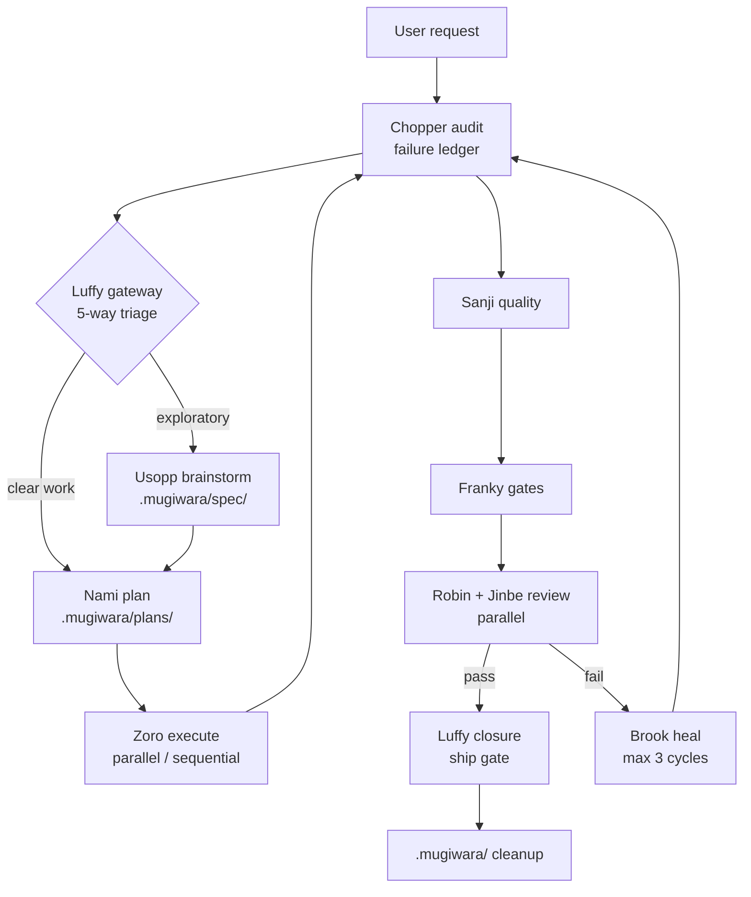

# Mugiwara

[](https://www.npmjs.com/package/@ionivetech/mugiwara)
[](https://github.com/ionivetech/mugiwara/blob/main/LICENSE)
[](https://www.npmjs.com/package/@ionivetech/mugiwara)
[](https://github.com/ionivetech/mugiwara/actions)
[](https://github.com/ionivetech/mugiwara)
[](https://bun.sh)
[](https://github.com/ionivetech/mugiwara)

The Straw Hat crew of AI agents and skills.

Zero runtime: pure markdown your existing AI agent runs with its own subagent
machinery — no daemons, no plugins to keep updated, nothing to host.

## Why Mugiwara

- 🧭 **A named crew.** Ten specialist agents — Luffy orchestrates, Nami plans,
  Zoro executes, Chopper audits, Brook heals — each with a narrow job.
- 📦 **No runtime.** Ships markdown only: native skills and agents for
  Claude Code, opencode, Copilot, Gemini CLI, Codex, Windsurf, Cline,
  Kilo Code, and Antigravity.
- 🔁 **Wave pipeline.** brainstorm → plan → execute → audit → quality → gates
  → review → security → heal → closure. Failure loops back through healing
  (max 3 cycles), never ships broken.
- 🛡 **Evidence over claims.** No wave passes on assertion — the owning agent
  shows output. No evidence, not complete.
- ⚡ **One-command install.** `npx`, `npm -g`, curl, or PowerShell — interactive
  wizard or fully scriptable with flags.
- 🧪 **Everything validated.** Coverage gates, build gates, OWASP security
  review, doubt-driven diff review, Definition of Done.

### The crew — 15 agents

Each agent is a focused specialist. Agents are dispatched by your AI tool's
subagent machinery and may call the crew's shared skills.

| Agent | Crew member | Role |
|-------|-------------|------|
| `using-mugiwara` | Front Door | Start here: routes any request to the right crew member — no agent names to remember |
| `luffy-orchestrator` | Luffy | Main gateway: 5-way triage, background check-ins, work splitting, decision log, closure |
| `usopp-brainstorm` | Usopp | Critical brainstorming friend: facts over hype, options + trade-offs, no over-engineering |
| `nami-planner` | Nami | Interview-first planner: full-context scan, wave structure, anti-patterns, parallel-safe plans |
| `zoro-execution` | Zoro | Execute plans: todo list first, parallel/sequential subagent dispatch, evidence per task |
| `chopper-checkpoint` | Chopper | Verify-everything audit of wave results; writes the failure ledger (never fixes code) |
| `sanji-quality` | Sanji | Discover the stack, then format/lint/test; integration tests only with consent |
| `franky-gates` | Franky | Binary gates: coverage ≥90/80, build exit 0, Definition of Done |
| `robin-reviewer` | Robin | Doubt-driven diff review: breaking-change first, five-axis, severity-tagged findings |
| `jinbe-security` | Jinbe | Security review: OWASP, secrets, injection, auth, dependencies, untrusted-data doctrine |
| `brook-healing` | Brook | Reads the blocker ledger, Stop-the-Line root-cause fixes, ≤3 heal cycles |
| `skeptic-verifier` | Skeptic | Adversarial verification: doubt every output/plan/verdict, find what's wrong, do NOT validate |
| `eval-runner` | Eval Runner | Test engineer for the harness itself: task suites, judge-agent rubric comparison, fix the skill not the eval |
| `resume-coordinator` | Resume Coordinator | Rebuild the picture from `.mugiwara/` state after context loss; continue, never restart |
| `memory-keeper` | Memory Keeper | Institutional memory: surface past lessons at mission start, capture new ones at closure |

### The techniques — 21 skills

| Skill | Purpose |
|-------|---------|
| `mugiwara-workflow` | The harness entry point: gateway triage, wave pipeline, workspace layout, blocker protocol, cleanup |
| `mugiwara-orchestration` | Luffy's captain behavior: 5-way classifier, check-ins, work splitting, decision log, closure |
| `mugiwara-brainstorm` | Usopp's critical sparring: interrogate, research facts, cut over-engineering, recommend |
| `mugiwara-planning` | Interview-first, full-context scan, wave plans with parallel/sequential markers + anti-patterns |
| `mugiwara-execution` | Todo list, parallel batches + sequential chains, 6-field subagent delegation, one task one commit |
| `mugiwara-checkpoint` | Verify-everything audit of every acceptance criterion; failure rows to the blocker ledger |
| `mugiwara-quality` | Discover the project's real tooling; formatter, linter, unit + consent-gated integration tests |
| `mugiwara-gates` | Coverage ≥90% new / ≥80% modified files, build validation, Definition of Done |
| `mugiwara-review` | Doubt-driven review: breaking-change analysis, five-axis, severity-tagged findings |
| `mugiwara-security` | OWASP-driven security review, untrusted-data doctrine, severity by exploitability × impact |
| `mugiwara-healing` | Reads the ledger, Stop-the-Line + Prove-It root-cause fixes, rollback prep |
| `mugiwara-frontend` | Anti-slop frontend: audit-first redesigns, design-system extraction, slop list |
| `mugiwara-git` | Atomic commits, save-points, multi-commit splitting, bisect/blame debugging |
| `mugiwara-ship` | GO/NO-GO ship gate: pre-launch checklist, feature flags, rollback plan |
| `mugiwara-dynamic-workflow` | Runtime workflow patterns: fan-out-and-synthesize, tournament, loop-until-done, classify-and-act, adversarial verification |
| `mugiwara-agent-security` | Secure the agent layer: prompt injection, memory poisoning, excessive agency, secret handling, sandboxing |
| `mugiwara-backend` | Backend/server code: repo standards first, API design, data integrity, error handling, correctness, performance, server-side security |
| `mugiwara-eval` | Test the harness itself: task suites, judge-agent rubric comparison, pass/fail per case |
| `mugiwara-observability` | Trace the crew: structured logs, OTel-compatible spans, session correlation, end-of-mission summary |
| `mugiwara-resume` | Session resume: rebuild state from `.mugiwara/` after compaction/loss; never restart |
| `mugiwara-lessons` | Cross-mission memory: actionable lessons ledger, read at triage, written at closure |

### Frontend anti-slop gating

`--type frontend` or `--type fullstack` includes `mugiwara-frontend` in the
install; `backend` and `general` skip it. The skill enforces audit-first
redesigns, extracts the design system from the reference, and bans generic
AI-slop patterns — framework-agnostic.

## How it works

Every mission starts with `using-mugiwara` — the easy-to-remember front door
that routes you to the right crew member (no agent names to memorize). It
feeds the **Luffy gateway**, which classifies the request (trivial / explicit /
exploratory / open-ended / ambiguous) and routes it: exploratory ideas go to
Usopp's brainstorm, clear work goes straight to Nami's planning. You can also
summon any crew member directly. From there the mission runs as a **wave
pipeline** owned by one crew member per wave.



The same pipeline as a portable table (renders anywhere markdown does):

| Wave | Owner | Skill | Output |
|------|-------|-------|--------|
| 0 Triage | Luffy | `mugiwara-orchestration` | 5-way route decision + reason |
| 1 Brainstorm | Usopp | `mugiwara-brainstorm` | refined direction, options, recommendation |
| 2 Planning | Nami | `mugiwara-planning` | plan doc: waves, tasks, acceptance criteria |
| 3 Execution | Zoro | `mugiwara-execution` | implemented tasks with evidence |
| 4 Checkpoint | Chopper | `mugiwara-checkpoint` | audit report + failure ledger |
| 5 Quality | Sanji | `mugiwara-quality` | formatter/linter/test results |
| 6 Gates | Franky | `mugiwara-gates` | coverage + build verdict |
| 7 Review | Robin ∥ Jinbe | `mugiwara-review` + `mugiwara-security` | severity-tagged findings (parallel) |
| 8 Healing | Brook | `mugiwara-healing` | fixes; loops back to Wave 4, max 3 cycles |
| 9 Closure | Luffy | `mugiwara-orchestration` | closure report appended to the plan |

Two rules hold the pipeline together:

- **Evidence over claims.** No wave passes on assertion — the owning agent runs
  the checks and shows output. A wave that cannot produce evidence is a failed
  wave. ("Subagents lie. No evidence = not complete.")
- **The plan is the source of truth.** From Wave 2 on, everything lives in
  `.mugiwara/plans/<date>-<mission>.md`. No wave is skipped without the reason
  recorded there.

### The `.mugiwara/` workspace

Every mission works inside `.mugiwara/` at the repo root:

```
.mugiwara/
├── spec/          # brainstorm output: YYYY-MM-DD-<mission>.md
├── plans/         # plan docs — single source of truth from Wave 2
├── results/       # wave results: audits, test output, gate verdicts, todos
├── review/        # review + security findings
├── issues/        # blocker + failure ledger: YYYY-MM-DD-<mission>-blockers.md
└── logs/          # Luffy's decision log
```

**Blocker protocol:** any crew member that hits a blocker appends a row
(`wave | task | symptom | attempted | help-needed`) to
`.mugiwara/issues/YYYY-MM-DD-<mission>-blockers.md` and escalates — never a silent
workaround. Brook reads the ledger in Wave 8 and heals what it lists.

**Cleanup:** at closure, Luffy deletes the superseded intermediate markdown
files (consumed results, review, and issues reports). The plan doc and closure
report stay.

The owning agent creates the folder it needs on first write. Mission artifacts
never land outside `.mugiwara/`.

## Install

Requires **Node.js >= 20.11**. Bun is optional — you only need it to build
from source.

### npx

```bash
# npx — run without installing (recommended)
npx @ionivetech/mugiwara@latest

# interactive wizard (scope, target agent, project type)
# non-interactive: global Claude Code install, general type, no prompts
npx @ionivetech/mugiwara@latest --global --target claude --type general --yes

# non-interactive: project install for opencode + GitHub Copilot, frontend type
npx @ionivetech/mugiwara@latest --project ./my-app --target opencode,copilot --type frontend --yes
```

### npm — global install

```bash
# npm — global install, run `mugiwara` anywhere
npm install -g @ionivetech/mugiwara
```

### curl — macOS / Linux

```bash
# curl — macOS/Linux one-liner
curl -fsSL https://raw.githubusercontent.com/ionivetech/mugiwara/main/scripts/install.sh | bash
```

### PowerShell — Windows

```powershell
# PowerShell — Windows one-liner
irm https://raw.githubusercontent.com/ionivetech/mugiwara/main/scripts/install.ps1 | iex
```

The `install.sh` / `install.ps1` scripts check your Node version, then run the
same CLI (`npx -y @ionivetech/mugiwara@latest`), forwarding any flags you pass.

### skills.sh — skills only, any agent

The 21 skills also ship in the standard [agentskills.io](https://agentskills.io)
layout (`skills/<name>/SKILL.md`), so you can install just the skills into
Claude Code, opencode, Copilot, Cursor, Codex, Gemini CLI, and 70+ other agents
via the [skills.sh](https://skills.sh) CLI:

```bash
npx skills add ionivetech/mugiwara
```

Skills only — the agents (Luffy, Nami, Zoro, …) are harness-specific and install
via the mugiwara CLI or Claude plugin above. `mugiwara skills` lists the
installable set.

### Requirements

| Dependency | Required for | Version |
|------------|--------------|---------|
| Node.js | running the CLI and the built artifact | >= 20.11 |
| Bun | building from source, running tests | optional |

## Quickstart

```console
$ npx @ionivetech/mugiwara@latest --global --target claude --type general --yes
mugiwara — installing crew for: claude
  ✓ claude    15 agents, 21 skills → ~/.claude/skills + ~/.claude/agents
  ✓ manifest  wrote ~/.mugiwara/manifest.json
  ✓ done      24 files written

$ # now just ask your Claude Code session
> add dark mode to the settings page

  Wave 0  Luffy   triage → route: plan (requirements mostly clear)
  Wave 2  Nami    plan   → .mugiwara/plans/2026-08-10-dark-mode.md (3 waves)
  Wave 3  Zoro    execute→ 3 tasks, evidence shown per task
  Wave 4  Chopper audit  → FAIL: toggle does not persist (ledger written)
  Wave 8  Brook   heal   → fixed persistence + tests, looped back → PASS
  Wave 9  Luffy   closure→ report appended to plan, intermediate files cleaned
```

You never drive the sequence — you answer Nami's clarifying questions up front
and review Brook's rollback note if a fix is risky.

## Commands and flags

### Commands

| Command | Effect |
|---------|--------|
| `mugiwara install` | Install the crew (default; wizard when flags are missing) |
| `mugiwara update` | Replace installed files, backing up differences to `.mugiwara/backup/<timestamp>/` first (project root, or `~` for global) |
| `mugiwara uninstall` | Remove exactly what the install manifest recorded |
| `mugiwara list` | Show installations (project + global manifests) |
| `mugiwara skills` | List the installable skills (agentskills.io) + skills.sh install command |
| `mugiwara --help` | Print usage and flags |
| `mugiwara --version` | Print the package version |

### Flags

| Flag | Meaning |
|------|---------|
| `--global` | Install user-wide (writes to your home directory) |
| `--project <dir>` | Install into a project directory (default: current directory) |
| `--target <ids\|all>` | Comma-separated target IDs, or `all`. Valid: `claude, opencode, copilot, gemini, codex, windsurf, cline, kilo, antigravity` |
| `--type <t>` | Project type: `frontend`, `backend`, `fullstack`, `general`. `frontend`/`fullstack` include `mugiwara-frontend` |
| `--yes`, `-y` | Non-interactive. Requires `--global` or `--project`, `--target`, and `--type` |
| `--force` | Overwrite files that differ (conflicting files are backed up first) |
| `--dry-run` | Print the actions without writing anything |

```bash
# non-interactive install requires all three, or it errors out
npx @ionivetech/mugiwara@latest --project ./app --target claude --type frontend --yes

# preview what an install would write, without touching the disk
npx @ionivetech/mugiwara@latest --global --target all --type general --yes --dry-run

# global installs skip targets that only support project scope (with a note)
npx @ionivetech/mugiwara@latest --global --target all --type general --yes
```

### Install manifest

Every install writes `.mugiwara/manifest.json` (in the project dir, or `~` for
global). The manifest records the version, scope, type, targets, and the exact
list of written files — which is what `update` and `uninstall` use to operate
safely.

## Targets

All nine supported targets. **Native** targets get first-class skills and
agents; the rest get markdown rule files the tool picks up from a conventions
directory. Targets marked *project only* are skipped (with a note) when you
install with `--global`.

| Target | Scope | Installs as |
|--------|-------|-------------|
| Claude Code | global + project | Native skills (`SKILL.md`) + agents in `.claude/skills` / `.claude/agents` (`~/.claude` globally) |
| opencode | global + project | Native skills + agents in `.opencode/skills` / `.opencode/agents` (`~/.config/opencode` globally) |
| GitHub Copilot | global + project | Skills as `.instructions.md` files + agents in `instructions/` / `agents/` (`.github` project, `~/.copilot` global) |
| Gemini CLI | project only | Markdown rules in `.gemini/mugiwara/` + `GEMINI.md` pointer |
| Codex | project only | Markdown rules in `.codex/mugiwara/` + `AGENTS.md` pointer |
| Windsurf | project only | Rules files in `.devin/rules` |
| Cline | project only | Rules files in `.clinerules` |
| Kilo Code | project only | Rules files in `.kilo/rules` + `kilo.jsonc` pointer |
| Antigravity | project only | Rules files in `.agents/rules` |

For rule-based targets, skills land as `mugiwara-*.md` and agents as
`agent-<name>.md`. Targets with a bootstrap file (`Gemini`, `Codex`, `Kilo`)
create it if it doesn't exist and otherwise tell you the line to add, so your
tool points at the crew.

## Claude Code plugin install

Mugiwara also ships as a **Claude Code plugin** with a marketplace — the
primary target. The plugin bundles the 15 agents + 21 skills as copies at the
repo root (`agents/`, `skills/`) plus a `SessionStart` hook that announces the
crew. Regenerate the copies from `content/` with `.claude-plugin/sync.sh`.

```bash
# Claude Code (fully supported)
/plugin marketplace add ionivetech/mugiwara
/plugin install mugiwara
```

GitHub Copilot CLI can read the same `.claude-plugin/` marketplace and consume
the skills as native Copilot skills:

```bash
# GitHub Copilot CLI (skills + marketplace readable)
copilot plugin marketplace add ionivetech/mugiwara
copilot plugin install mugiwara
```

> **Copilot caveat.** The agents are **Claude-native `.md` files** — they will
> not auto-discover in Copilot and may need `.agent.md` conversion to work as
> Copilot plugin agents. Skills install and function; agents are best consumed
> through the regular CLI install path (which writes Copilot-native
> `.instructions.md` skills and `.md` agents).

## FAQ / troubleshooting

**Why is the content so short?** The skills are dense instructions, not prose.
Each agent/skill file is one flat-frontmatter markdown doc, body ≤120 lines —
short enough for your AI tool to read fully and act on. Density beats verbosity:
the harness doesn't ship essays, it ships protocols.

**Do I need Bun?** No. The runtime is plain Node.js >= 20.11 — the built
artifact (`dist/mugiwara.js`) runs on Node. Bun is only for building from
source and running tests.

**How is Mugiwara different from a framework like CrewAI?** CrewAI is a
runtime you program against. Mugiwara is content-only: markdown skills and
agents your existing AI tool loads natively and executes with its own subagent
machinery. There is no runtime, no SDK, nothing to host.

**Does it work on Windows?** Yes — PowerShell one-liner
(`irm ...install.ps1 | iex`), and the CLI itself runs anywhere Node >= 20.11
does.

**How do I uninstall?** `mugiwara uninstall` removes exactly what the install
manifest recorded — nothing more, nothing less. For a plugin install, remove it
from the plugin marketplace/manager instead.

**Why is the npm package `@ionivetech/mugiwara` and not `mugiwara`?**
`mugiwara` is taken on npm. The package is scoped as `@ionivetech/mugiwara`;
all install methods above already point at the scoped name.

**Where does a plugin install put files?** At the repo root of the plugin
itself (`agents/`, `skills/`), plus a `SessionStart` hook — it does not copy
into your project's `.claude/`. The CLI install is what writes into your
project or home directory.

**How do updates work?** `mugiwara update` replaces installed files, backing up
differences to `.mugiwara/backup/<timestamp>/` first. Plugin installs update
through the plugin marketplace when the repo publishes new content.

## Development

### Prerequisites

- **Bun** — the build and test toolchain
- **Node.js >= 20.11** — the built artifact runs on plain Node

```bash
bun install              # install dev dependencies
bun run build            # bundle src/cli.ts → dist/mugiwara.js (Bun, ESM, node target)
bun run test             # vitest suites
bun run typecheck        # tsc --noEmit
bun run validate         # node scripts/validate-content.mjs — content schema lint
node dist/mugiwara.js --version   # smoke-test the built CLI
```

`bun run build` runs automatically on `npm pack` / `npm publish` (via
`prepack`).

### Project layout

```
mugiwara/
├── src/                 # TypeScript: CLI, installer, target adapters
│   └── targets/         # one adapter per AI agent (claude, opencode, gemini, ...)
├── test/                # vitest suites
├── content/             # single source of truth for the crew
│   ├── skills/          # 21 skills (one dir per skill, SKILL.md inside)
│   └── agents/          # 15 agents (<name>.md)
├── scripts/             # install.sh, install.ps1, validate-content.mjs
├── hooks/               # Claude Code SessionStart hook (hooks.json + session-start.js)
├── .claude-plugin/      # Claude plugin + marketplace metadata; sync.sh copies
├── agents/              # plugin copies of content/agents/ (generated by sync.sh)
├── skills/              # plugin copies of content/skills/ (generated by sync.sh)
├── dist/                # bundled CLI output (generated, gitignored)
├── docs/                # specs, plans, research
└── package.json
```

### Adding a skill

1. Create `content/skills/<name>/SKILL.md` — flat frontmatter (`name`,
   `description`), body ≤ 120 lines.
2. Reference it from at least one agent's `skills` field in
   `content/agents/*.md`.
3. Run `bun run validate` to confirm it passes the schema.
4. Re-sync the plugin copies with `.claude-plugin/sync.sh`.

### Adding an agent

1. Create `content/agents/<name>.md` with a `skills` field listing the skills
   it calls.
2. Run `bun run validate`.
3. Re-sync with `.claude-plugin/sync.sh`.

## Content schema

Every skill and agent is a single markdown file with **flat frontmatter** — no
nested fields:

```yaml
---
name: mugiwara-example
description: Use when <trigger condition> — <what it does, how it behaves>.
---

<body>
```

| Rule | Detail |
|------|--------|
| Naming | `name` must equal the directory (skills) or file (agents) name |
| Description | `description` 20–500 characters for skills, ≥20 for agents |
| Trigger phrasing | Descriptions start with "Use when …" (skills) or "Dispatch when …" (agents) so your AI tool auto-selects the right one |
| Skill body | ≤ 120 lines |
| Agent `skills` | Every agent must list the skills it calls, comma-separated; each must exist |
| References | Every skill except `mugiwara-workflow` must be referenced by at least one agent |
| Uniqueness | No duplicate `name` across skills and agents |

Run `bun run validate` before opening a PR — it checks all of this and exits
non-zero on any violation.

## Contributing

Open an issue or pull request on GitHub. If you add content (skills/agents),
follow the [content schema](#content-schema) and run `bun run validate` before
opening the PR.

## Resources

- GitHub: <https://github.com/ionivetech/mugiwara>
- npm: <https://www.npmjs.com/package/@ionivetech/mugiwara>
- Star history: <https://star-history.com/#ionivetech/mugiwara>

## License

MIT. Copyright (c) 2026 ionive. See [LICENSE](LICENSE).

---

[](https://star-history.com/#ionivetech/mugiwara)
